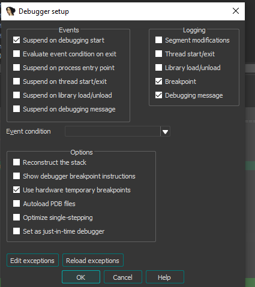
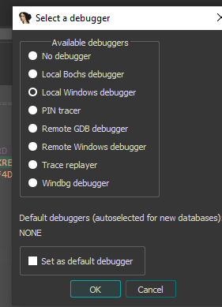

ScyllaHide attach guide for IDA

This short guide explains how to correctly attach with ScyllaHide when debugging with IDA. It shows the required IDA debugger settings and the exact sequence to follow so ScyllaHide hooks are applied properly.

Important: correct IDA debugger settings first
Before launching or attaching, configure IDA like shown below.

1) Debugger settings

2) Per‑debugger options panel

Attach/launch workflow
Follow this order to ensure ScyllaHide is active when code starts running:

1) Start the process in IDA
- Use “Debug -> Start process” (do NOT run it to completion yet).
- Ensure the process is paused at the very beginning.

2) Inject ScyllaHide
- While the debuggee is paused, run the injector script from this folder:
  - ./inject.sh

3) Continue debugging
- Return to IDA and let it run to completion.
- ScyllaHide’s anti‑anti‑debug hooks will now be active.
